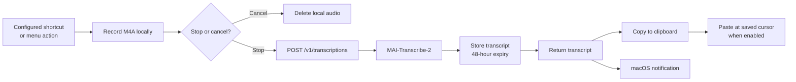
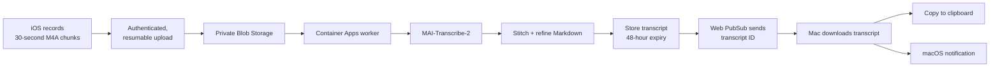

# VoicePrompt

VoicePrompt privately converts long Czech/mixed-English voice notes into polished,
copy-ready Markdown. The monorepo contains native iOS and macOS apps, a shared
Swift package, a FastAPI backend, and private Azure infrastructure.

## Layout

- `Apple/VoicePromptIOS` — immediate local recording, 30-second AAC/M4A segments,
  resilient upload queue, background-audio capability, hold-to-talk and start/stop UI.
- `Apple/VoicePromptMac` — Dockless menu-bar app, Web PubSub completion listener,
  exactly-once clipboard delivery, native notification, and 48-hour history.
- `Packages/VoicePromptKit` — versioned models, API client, Keychain storage, retries,
  and durable upload metadata.
- `backend` — authenticated FastAPI API, idempotent worker, retention job, Foundry
  speech/refinement client, and Managed Identity Azure adapters.
- `infrastructure` — Terraform for VNet-integrated Container Apps, private Storage,
  private DNS, Managed Identity/RBAC, Web PubSub, and telemetry.
- `api/openapi.json` — committed API contract.

## Data flows

VoicePrompt has two transcription paths. The Mac path prioritizes immediate
verbatim text, while the iOS path supports long, resilient recordings and produces
refined Markdown.

### Mac quick transcription

Press the configurable global shortcut—**Shift-Command-Space** by default—or choose
**Start Quick Transcription** from the menu-bar panel. Stopping releases the
microphone before the authenticated request begins, so another recording can start
while earlier audio is transcribing. Cancel deletes the local recording without
sending it.



The direct Mac request does not use the cleanup model or Blob Storage. The API
temporarily converts the request audio to WAV, sends it to the Foundry Speech
endpoint, stores the verbatim result in Table Storage, and returns it in the same
HTTP response. That response triggers clipboard delivery and, by default, inserts
the text at the cursor in the app that was active when recording started. Direct
paste can be disabled in Mac settings. Web PubSub is not required for this immediate
path.

### iOS recording to Mac delivery



If the Mac misses a Web PubSub event, it reconciles transcript history on launch,
wake, reconnect, and periodic polling. See
[Architecture decisions](docs/architecture.md) for detailed sequence diagrams,
state transitions, storage cleanup, and notification behavior.

## Local validation

```bash
python3 -m venv .venv
.venv/bin/pip install -e 'backend[test]'
.venv/bin/pytest backend/tests
.venv/bin/python scripts/export-openapi.py
(cd Packages/VoicePromptKit && swift test)
docker build -t voiceprompt:local backend
```

On macOS, install XcodeGen, run `make apple-project`, then build the iOS simulator
and macOS schemes in `Apple/VoicePrompt.xcodeproj`.
For a local menu-bar app installation, see
[Local Mac installation](docs/configuration.md#local-mac-installation).

Development authentication is disabled by default. For local-only API work, copy
`backend/.env.example`, leave Azure resource fields empty, and explicitly set
`VOICEPROMPT_ALLOW_DEVELOPMENT_AUTH=true`; a development credential prefixed with
`dev:` is then accepted. Never enable this setting in a deployed environment.

See `docs/architecture.md`, `docs/configuration.md`, and `docs/validation.md`.
