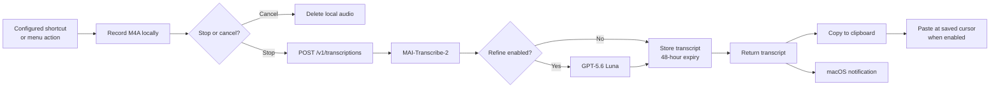
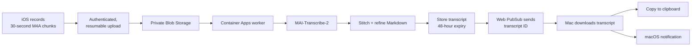

# VoicePrompt

VoicePrompt privately converts long Czech/mixed-English voice notes into polished,
copy-ready Markdown. The monorepo contains native iOS and macOS apps, a shared
Swift package, a FastAPI backend, and private Azure infrastructure.

## Layout

- `Apple/VoicePromptIOS` — immediate local recording, 30-second AAC/M4A segments,
  resilient upload queue, background-audio capability, hold-to-talk and start/stop UI.
- `Apple/VoicePromptMac` — Dockless menu-bar app, Web PubSub completion listener,
  exactly-once clipboard delivery, native notification, and 48-hour history.
- `Packages/VoicePromptKit` — versioned models, API client, Keychain storage, retries,
  and durable upload metadata.
- `backend` — authenticated FastAPI API, idempotent worker, retention job, Foundry
  speech/refinement client, and Managed Identity Azure adapters.
- `infrastructure` — Terraform for VNet-integrated Container Apps, private Storage,
  private DNS, Managed Identity/RBAC, Web PubSub, and telemetry.
- `api/openapi.json` — committed API contract.

## Guided deployment and installation

The recommended installation path is the repository's Copilot deployment skill.
After cloning the repository, open it with GitHub Copilot and enter:

```text
/deployment-helper go
```

The helper first asks whether you want the macOS app and backend only, or also
want the optional iOS app. It then checks prerequisites, configures Entra and the
Foundry connection, prepares and applies the Azure infrastructure with your
approval, deploys and verifies the backend, and builds and installs the macOS
menu-bar app.

You should already be signed in to Azure with resource-creation, role-assignment,
and app-registration permissions. Interactive sign-in, admin consent, Terraform
plan approval, Foundry model availability, and macOS privacy permissions remain
under your control. See the
[complete setup guide](docs/configuration.md#recommended-copilot-assisted-setup)
for prerequisites, the manual alternative, and troubleshooting.

## Data flows

VoicePrompt has two transcription paths. The Mac path prioritizes immediate
delivery with optional Luna refinement, while the iOS path supports long,
resilient recordings and produces refined Markdown.

### Mac quick transcription

Press the configurable global shortcut—**Shift-Command-Space** by default—or choose
**Start Quick Transcription** from the menu-bar panel. Stopping releases the
microphone before the authenticated request begins, so another recording can start
while earlier audio is transcribing. Cancel deletes the local recording without
sending it.

Recording starts with a minimized HUD showing only a 17-bar, audio-reactive waveform
and a small **Stop** button. Click the waveform to expand it to the full HUD, with an
elapsed **MM:SS** timer, **Refine**, **Cancel**, and a minimize control. The timer tracks
recorded audio from the beginning and keeps counting while minimized. Processing
and errors automatically use the expanded HUD.



The direct Mac request does not use Blob Storage. The API temporarily converts
the request audio to WAV, sends it to the Foundry Speech endpoint, and optionally
runs Luna with the built-in prompt plus the user's Mac-specific instructions.
The resulting text is stored in Table Storage and returned in the same HTTP
response. That response triggers clipboard delivery and, by default, inserts the
text at the cursor in the app that was active when recording started. Direct paste
can be disabled in Mac settings. Web PubSub is not required for this immediate path.

### iOS recording to Mac delivery



If the Mac misses a Web PubSub event, it reconciles transcript history on launch,
wake, reconnect, and periodic polling. See
[Architecture decisions](docs/architecture.md) for detailed sequence diagrams,
state transitions, storage cleanup, and notification behavior.

## Local validation

```bash
python3 -m venv .venv
.venv/bin/pip install -e 'backend[test]'
.venv/bin/pytest backend/tests
.venv/bin/python scripts/export-openapi.py
(cd Packages/VoicePromptKit && swift test)
docker build -t voiceprompt:local backend
```

On macOS, install XcodeGen, run `make apple-project`, then build the iOS simulator
and macOS schemes in `Apple/VoicePrompt.xcodeproj`.
For a guided backend deployment and menu-bar app installation, use
`/deployment-helper go`. For only the local app build, see
[Local Mac installation](docs/configuration.md#local-mac-installation).

Development authentication is disabled by default. For local-only API work, copy
`backend/.env.example`, leave Azure resource fields empty, and explicitly set
`VOICEPROMPT_ALLOW_DEVELOPMENT_AUTH=true`; a development credential prefixed with
`dev:` is then accepted. Never enable this setting in a deployed environment.

See `docs/architecture.md`, `docs/configuration.md`, and `docs/validation.md`.
