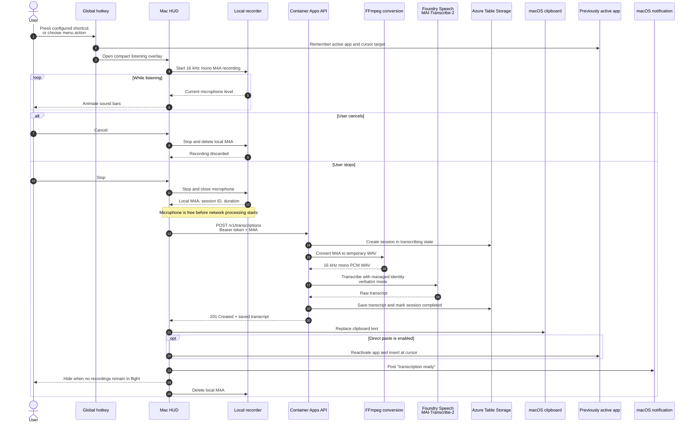
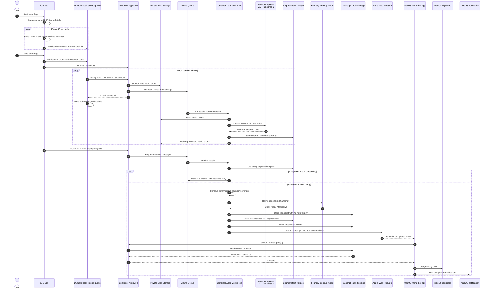

# Architecture decisions

## Capture and delivery

Recording is a local-first operation. The iOS app creates a UUID and starts
`AVAudioRecorder` before it performs any API call. AAC-LC mono audio at 16 kHz and
48 kbit/s is rotated into boundary-safe 30-second M4A files. Each file is hashed
and persisted independently, so a 20-minute note never needs to reside in memory.
The queue deletes a local file only after the API acknowledges its idempotent PUT.

The macOS quick-transcription path is intentionally latency-first. The configurable
global shortcut (`Shift-Command-Space` by default) or the menu-bar action opens a
compact HUD and records one local M4A file. Stop sends that recording to the
synchronous `POST /v1/transcriptions` endpoint, which calls MAI-Transcribe-2 and
stores the verbatim result directly without cleanup. The microphone is released
before the request begins, so another recording can start while earlier requests
remain in flight.

Completion uses Azure Web PubSub serverless delivery. The API issues ten-minute,
user-scoped WebSocket URLs; the worker sends only the transcript identifier to the
validated Entra tenant/object identity. The Mac performs low-frequency reconciliation on launch,
wake, and reconnect. It fetches every missed item but automatically copies only
the newest unseen completion.

## macOS quick-transcription sequence

The direct Mac path optimizes time-to-clipboard. Audio is not written to Azure Blob
Storage, no queue message is created, and the cleanup model is not called.

Every stopped recording owns an independent asynchronous request. The controller
tracks the number of requests in flight, while permitting one new active recording.
The HUD can therefore show “Listening” and an earlier-transcription count at the
same time.

The notification is local: the returned transcript is added to Mac history, marked
as already copied, placed on `NSPasteboard.general`, optionally inserted into the
focused control of the app that was active when recording began, and followed by a
`UNUserNotificationCenter` notification. Direct insertion requires the user-granted
macOS Accessibility permission and is enabled by default. Because the transcript ID
is marked as copied, later Web PubSub or reconciliation delivery does not copy it a
second time.

## iOS-to-Mac detailed sequence

The iOS path prioritizes durable long recordings and refined output. It transcribes
segments as they arrive, but final completion waits until every expected segment is
present and the assembled text has passed through the cleanup model.

Web PubSub carries only the transcript identifier, never transcript text. The Mac
uses its own Entra access token to retrieve the record, and the API rechecks
ownership. If the socket is disconnected or an event is lost, the Mac reconciles
the last 48 hours on launch, wake, reconnect, manual sync, and its low-frequency
poll. It fetches all missed records but automatically copies only the newest unseen
completion.

## State and processing

The explicit state path is `created -> uploading -> transcribing -> refining ->
completed`, with `failed` preserving an actionable error code. Blob names and
Table partitions contain a one-way subject hash. Queue messages contain only owner,
session, sequence, and work kind identifiers.

Transcription starts as each segment arrives. Segment text is idempotently stored,
the audio Blob is then deleted, and finalization waits for every sequence. Assembly
removes deterministic boundary overlap. The full raw text is refined once and
deleted immediately after the cleaned transcript is durable. Transcript expiry is
enforced by hourly cleanup at 48 hours; a one-day Blob lifecycle rule is a safety
net for abandoned audio.

## Identity and network

Clients use Microsoft Entra ID Authorization Code with PKCE through the system
browser. They request a delegated API scope and keep refresh credentials in
Keychain. The backend accepts Entra access tokens only after signature, exact
tenant, issuer, audience, expiry, object ID, delegated scope, and allow-list
validation. Resource ownership is checked on every operation.

Azure workloads use a user-assigned Managed Identity. Storage shared-key access and
public networking are disabled. Blob, Queue, and Table use private endpoints and
linked private DNS zones inside the Container Apps VNet. Web PubSub remains public
only as the selected authenticated client-notification endpoint and has local auth
disabled. RBAC grants only Storage Blob/Queue/Table Data Contributor, Web PubSub
Service Owner, and Cognitive Services User.

Microsoft Foundry deployments are external inputs so Terraform cannot accidentally
create a model deployment. The speech deployment must be selected after evaluating
available speech-capable models against the Czech fixture. Cleanup defaults to the
existing `gpt-5.6-luna` deployment and should be changed to Terra only if the
quality gate fails.
